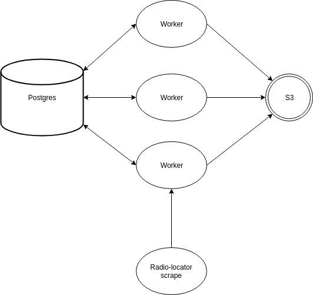

# Talk radio ingest
---

## Usage
This application ingests audio from radio stations which have online streams and
saves it to an S3 bucket. Various parts of this ingestion process are
configurable: the bucket, the number of ingest workers, the audio chunk size,
and more.

There are two ways to deploy and run the application:
* For a small number of stations, you can use the provided `docker-compose.yml`
  file. Copy `conf.env.template` to `conf.env` and put in your configuration
  options. (For what the allowed options are, see `entrypoint.sh` and `run.py`
  in the `images/worker` directory.)
* For a larger number of stations requiring more than one machine, the necessary
  infrastructure is packaged as a set of CloudFormation templates. Use the
  `aws-deploy/deploy.sh` script.

To use the application once deployed, you need to tell it what stations to work
on. This is a manual process requiring you to run a bit of sql:
1. Connect to the Postgres DB created in the CF template or docker-compose file.
   Insert station_id values for stations to scrape into the app.jobs table. The
   list of stations with metadata including URLs and station_ids is in the
   data.stations table.
2. On AWS, there's an autoscaling group but no autoscaling policy, so you'll
   have to manually adjust the desired counts of container instances and worker
   tasks. The default is 10 stations per container; each container instance can
   handle about 10 containers.

The application depends on a dataset of radio stations in a particular format,
originally from a third-party data provider,
[Radio-Locator](https://radio-locator.com/). The dataset includes the URLs to
scrape. If you want to update the URLs or other properties of the dataset, you
can either buy a subscription from Radio-Locator and [scrape it
again](https://github.com/mit-ccc/talk-radio/tree/master/data/radio_locator) or
update the data for stations you care about by hand.

## Architecture and source data
The application architecture at the moment is summarized by the following
diagram:



## AWS details
To deploy this ingest system on a new AWS account, follow these steps:
1. Create the SSM parameters the `aws-deploy/infrastructure.yml` template calls
   for (the database username and password). Absent a good reason not to, you
   should use the same names for the SSM parameters as are defaults in the
   template. The actual values of the parameters (the username and password you
   want the DB to use) are arbitrary.
2. [Create a Github OAuth token](https://github.com/settings/tokens) with 'repo'
   and 'admin:repo_hook' permissions on this repo (`talk-radio`). Our
   CodePipeline object will use the token to connect to Github and pull source
   code for the ingest application. Save the token somewhere; you'll use it in
   step 4.
3. Update the VPC and subnet IDs in the `infrastructure.yml` template (and push
   to this repo). Note the comments about subnet requirements - you may need to
   create the subnets manually.
4. Make sure the new AWS account has permission to access
   s3://lsm-data/talk-radio/radio.tar.gz, which is the radio-locator data the
   workers will use to populate the postgres database.
5. Run the `aws-deploy/deploy.yml` cloudformation template, which will also run
   the `aws-deploy/infrastructure.yml` template. The deploy template needs to be
   run as a suitably privileged user - a user with Administrator access is
   easiest. (Only the continuous delivery infrastructure, specifically
   CodePipeline, CodeBuild, and associated roles, will be run as this user.
   Other infrastructure will be created using roles the deploy template
   defines.) You'll need to pass the Github token to the template. Creating the
   pipeline will automatically run it, and running it will (after about 20
   minutes) stand up the ingest application. The application will automatically
   populate its database from the radio-locator data. Try a command like this
   one:
    * ```aws cloudformation create-stack --stack-name
      talk-radio-continuous-delivery --capabilities CAPABILITY_NAMED_IAM
      --parameters
      ParameterKey=GithubOAuthToken,ParameterValue=YOUR_GITHUB_TOKEN
      --template-body file:///PATH/TO/DEPLOY/deploy.yml```

## Areas for improvement
* No autoscaling: the ECS cluster is backed by an autoscaling group, but it has
  no actual autoscaling policies defined, just a static desired instance count.
  The number of queued jobs has nothing to do with the amount of provisioned
  capacity.
* Starting new jobs is a manual process: you need to run sql against the control
  DB.
